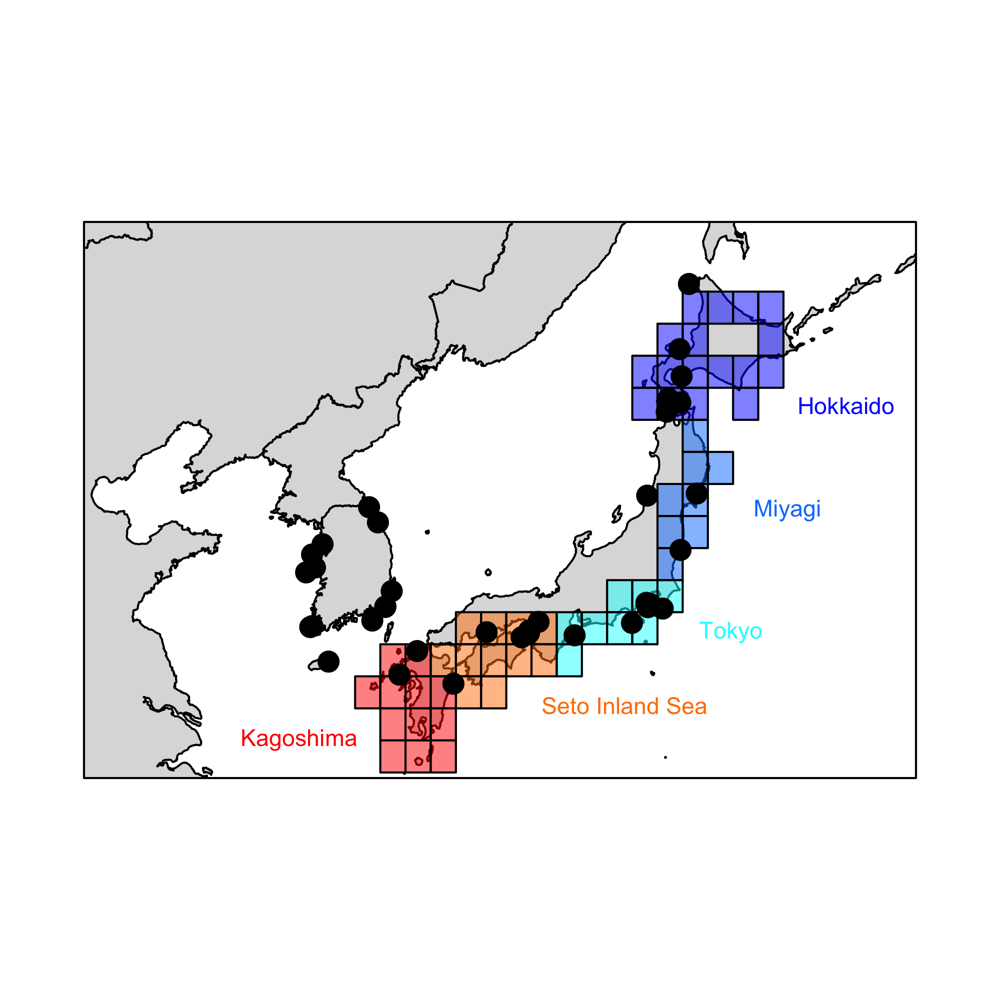
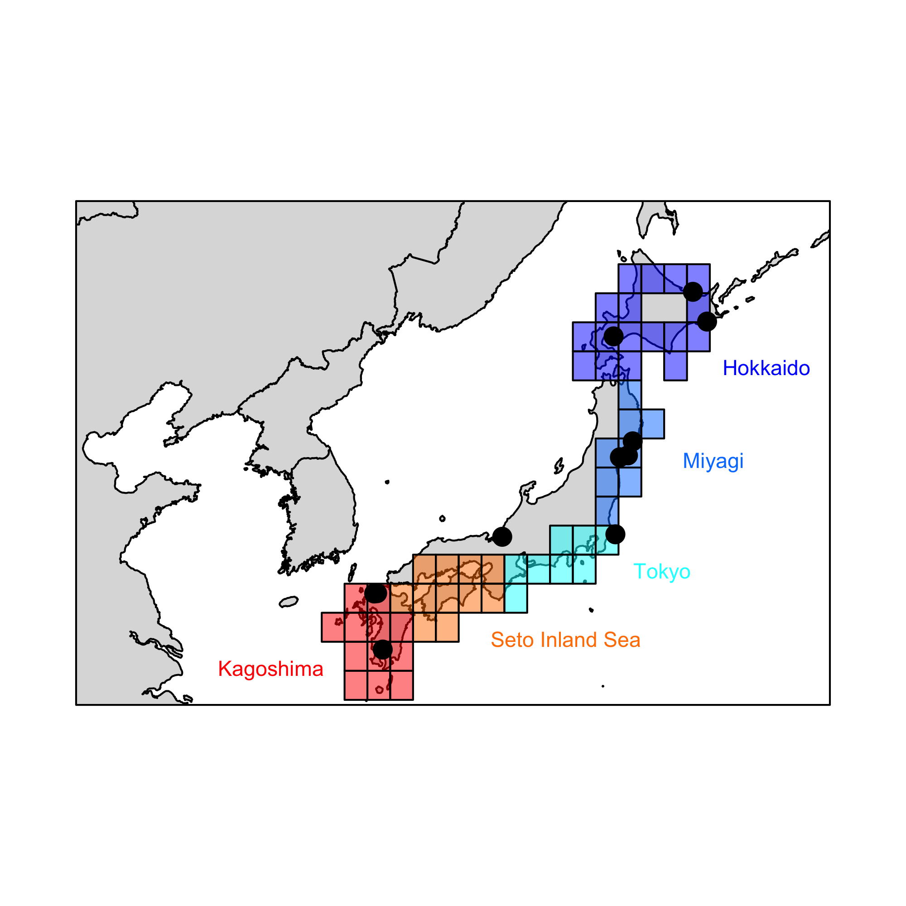
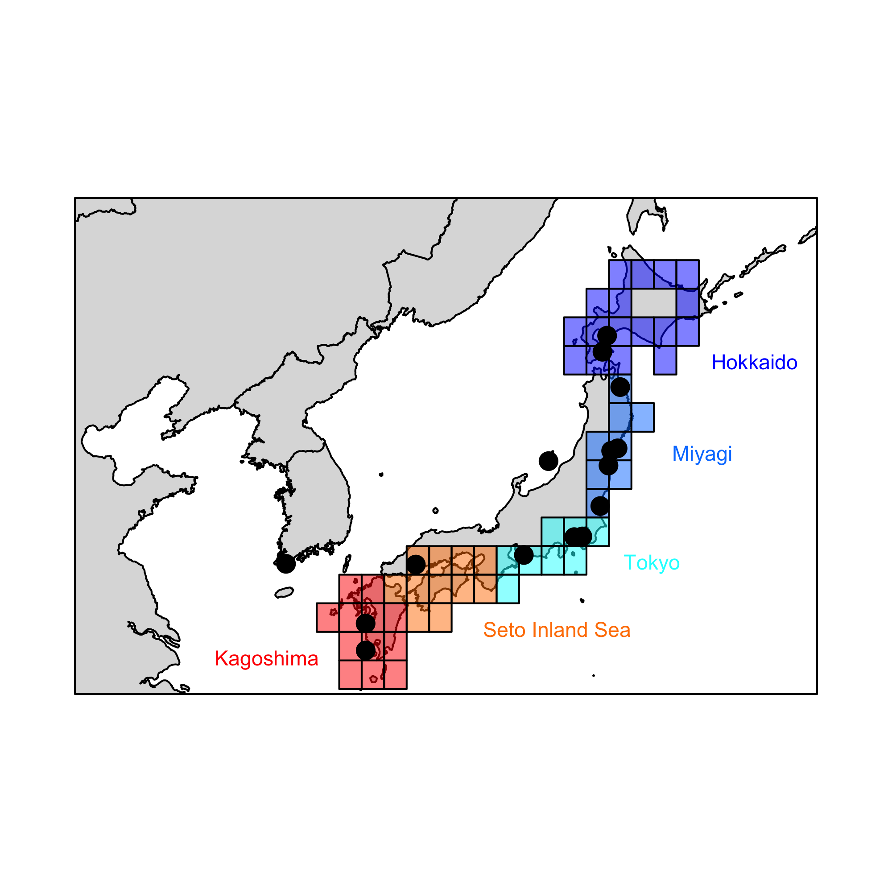
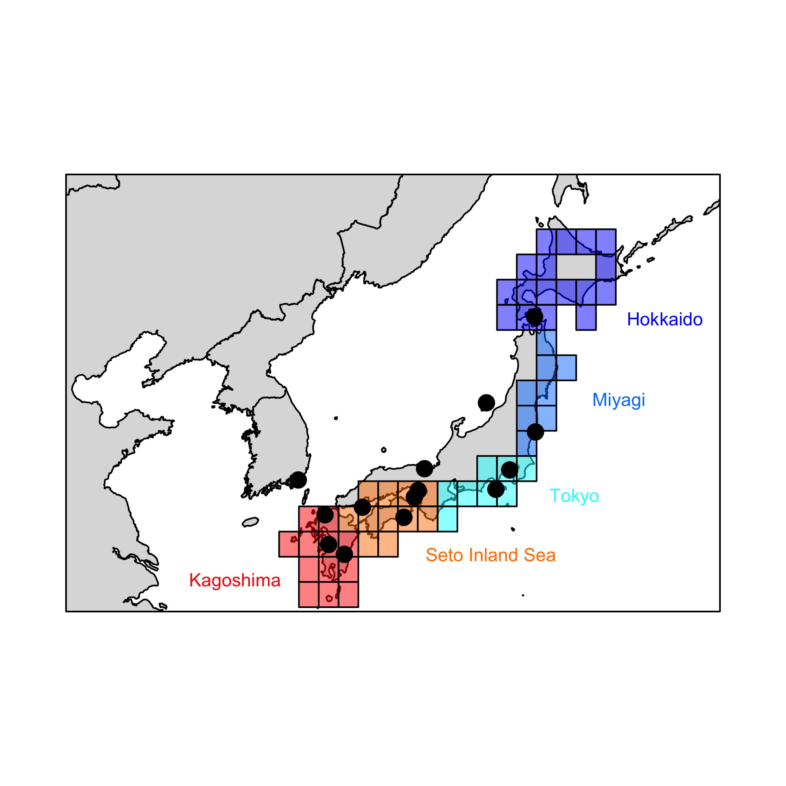
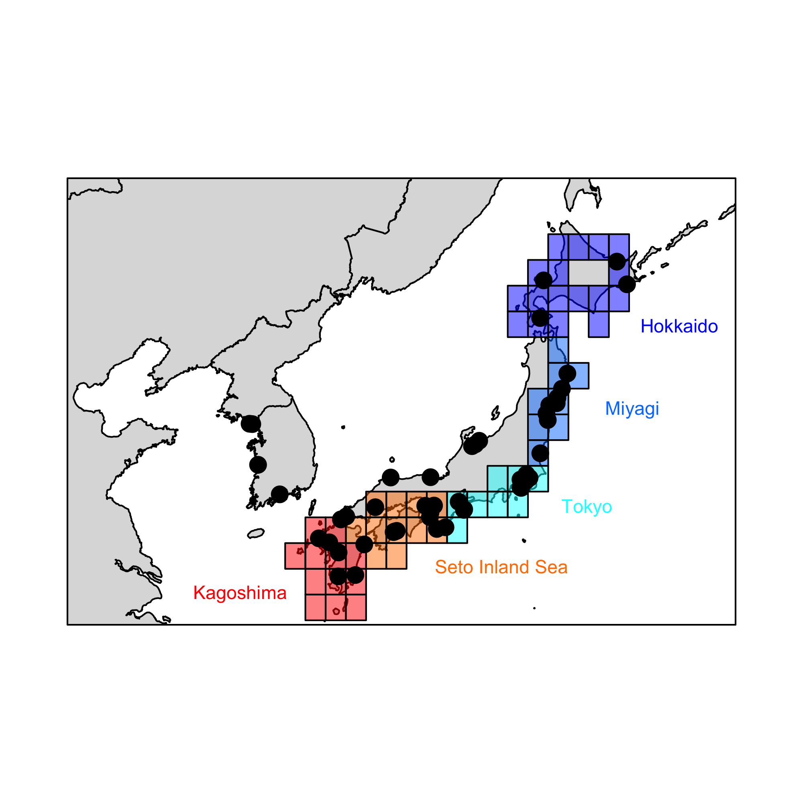

\vspace{-5truemm}
### KEY:

hok = Hokkaido\
hon = Miyagi\
tok = Tokyo Bay\
sea = Seto Inland Sea / Hiroshima\
kag = Kagoshima\
nonSource = western Japan / South Korea

\newpage

# Crassostrea gigas
## This study
```{r echo=F}
library(gridExtra)
library(knitr)
f <- read.csv("cgigas_sampleSize.csv",header=T)
```
Number of populations = `r dim(f)[1]`  
Number of ind per pop = `r round(mean(f$n),1)`  
Machine Learning output:  
```{r echo = F, out.width="75%",fig.align="center"}
tbl <- read.csv("cgigasByReg.csv",header=T,row.names=1)
if (min(tbl,na.rm=T)==0) {grid.table(tbl)} else {grid.table(tbl-0.01)}
```
Map of native populations:  
{width=50%}\

\newpage 
# Undaria pinnatifida
## Uwai et al 2006 Phycologia 45:687--695
```{r echo=F}
f <- read.csv("upinn_sampleSize.csv",header=T)
```
Number of populations = `r dim(f)[1]`  
Number of ind per pop = `r round(mean(f$n),1)`  
Machine Learning output:  
```{r echo=F, out.width="75%",fig.align="center"}
tbl <- read.csv("upinnByReg.csv",header=T,row.names=1)
if (min(tbl,na.rm=T)==0) {grid.table(tbl)} else {grid.table(tbl-0.01)}
```
Map of native populations:  
{width=50%}\

\newpage
# Didemnum vexillum
## Stefanik et al 2012 JEMBE 422--423:64--71
```{r echo=F}
f <- read.csv("dide_sampleSize.csv",header=T)
```
Number of populations = `r dim(f)[1]`  
Number of ind per pop = `r round(mean(f$n),1)`  
Machine Learning output:  
```{r echo=F, out.width="75%",fig.align="center"}
tbl <- read.csv("dideByReg.csv",header=T,row.names=1)
if (min(tbl,na.rm=T)==0) {grid.table(tbl)} else {grid.table(tbl-0.01)}
```
Map of native populations:  
{width=50%}\

\newpage
# Gracilaria vermiculophylla
## Flanagan et al. 2021 Molecular Ecology
```{r echo=F}
f <- read.csv("gvermSNP_sampleSize.csv",header=T)
```
Number of populations = `r dim(f)[1]`  
Number of ind per pop = `r round(mean(f$n),1)`  
Machine Learning output:  
```{r echo=F, out.width="75%",fig.align="center"}
tbl <- read.csv("gvermSNPByReg.csv",header=T,row.names=1)
if (min(tbl,na.rm=T)==0) {grid.table(tbl)} else {grid.table(tbl-0.01)}
```
Map of native populations:  
{width=50%}\

\newpage
# Haminoea japonica
## Hanson et al. 2013 PLoS ONE
```{r echo=F}
f <- read.csv("hami_sampleSize.csv",header=T)
```
Number of populations = `r dim(f)[1]`  
Number of ind per pop = `r round(mean(f$n,na.rm=T),1)`  
Machine Learning output:  
```{r echo=F, out.width="75%",fig.align="center"}
tbl <- read.csv("hamiByReg.csv",header=T,row.names=1)
if (min(tbl,na.rm=T)==0) {grid.table(tbl)} else {grid.table(tbl-0.01)}
```
Map of native populations:  
{width=50%}\

\newpage
# Batillaria attramentaria
## Miura et al. 2005 PNAS
```{r echo=F}
f <- read.csv("battr_sampleSize.csv",header=T)
```
Number of populations = `r dim(f)[1]`  
Number of ind per pop = `r round(mean(f$n,na.rm=T),1)`  
Machine Learning output:  
```{r echo=F, out.width="75%",fig.align="center"}
tbl <- read.csv("battrByReg.csv",header=T,row.names=1)
if (min(tbl,na.rm=T)==0) {grid.table(tbl)} else {grid.table(tbl-0.01)}
```
Map of native populations:  
{width=50%}\

\newpage
# Cercaria batillaria (HL1)
## Miura et al. 2005 PNAS
```{r echo=F}
f <- read.csv("battr_HL1_sampleSize.csv",header=T)
```
Number of populations = `r dim(f)[1]`  
Number of ind per pop = `r round(mean(f$n,na.rm=T),1)`  
Machine Learning output:  
```{r echo=F, out.width="75%",fig.align="center"}
tbl <- read.csv("battr_HL1ByReg.csv",header=T,row.names=1)
if (min(tbl,na.rm=T)==0) {grid.table(tbl)} else {grid.table(tbl-0.01)}
```
Map of native populations:  
{width=50%}\

\newpage
# Cercaria batillaria (HL6)
## Miura et al. 2005 PNAS
```{r echo=F}
f <- read.csv("battr_HL6_sampleSize.csv",header=T)
```
Number of populations = `r dim(f)[1]`  
Number of ind per pop = `r round(mean(f$n,na.rm=T),1)`  
Machine Learning output:  
```{r echo=F, out.width="75%",fig.align="center"}
tbl <- read.csv("battr_HL6ByReg.csv",header=T,row.names=1)
if (min(tbl,na.rm=T)==0) {grid.table(tbl)} else {grid.table(tbl-0.01)}
```
Map of native populations:  
{width=50%}\

\newpage
# Mutimo cylindricus
## Hanyuda et al 2018 Marine Pollution Data
```{r echo=F}
f <- read.csv("mcyl_sampleSize.csv",header=T)
```
Number of populations = `r dim(f)[1]`  
Number of ind per pop = `r round(mean(f$n,na.rm=T),1)`  
Machine Learning output:  
```{r echo=F, out.width="75%",fig.align="center"}
tbl <- read.csv("mcylByReg.csv",header=T,row.names=1)
if (min(tbl,na.rm=T)==0) {grid.table(tbl)} else {grid.table(tbl-0.01)}
```
Map of native populations:  
{width=50%}\

\newpage
# Hemigrapsus takanoi
## Makino et al 2018 Biological Invasions
```{r echo=F}
f <- read.csv("taka_sampleSize.csv",header=T)
```
Number of populations = `r dim(f)[1]`  
Number of ind per pop = `r round(mean(f$n,na.rm=T),1)`  
Machine Learning output:  
```{r echo=F, out.width="75%",fig.align="center"}
tbl <- read.csv("takaByReg.csv",header=T,row.names=1)
if (min(tbl,na.rm=T)==0) {grid.table(tbl)} else {grid.table(tbl-0.01)}
```
Map of native populations:  
{width=50%}\

\newpage
# Hemigrapsus sanguineus
## Blakeslee et al 2017 Marine Biology + GenBank
```{r echo=F}
f <- read.csv("sang_sampleSize.csv",header=T)
```
Number of populations = `r dim(f)[1]`  
Number of ind per pop = `r round(mean(f$n,na.rm=T),1)`  
Machine Learning output:  
```{r echo=F, out.width="75%",fig.align="center"}
tbl <- read.csv("sangByReg.csv",header=T,row.names=1)
if (min(tbl,na.rm=T)==0) {grid.table(tbl)} else {grid.table(tbl-0.01)}
```
Map of native populations:  
{width=50%}\
